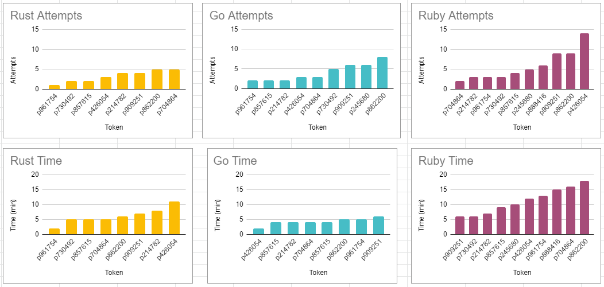
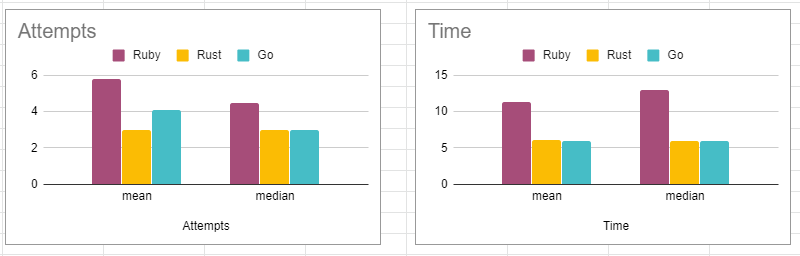

# Results for Homework 2 and Homework 3
 
## Data collection method

* After cloning the repository, the testers will find 3 folders named Ruby, Go and Rust. Each of the folders will contain “Game of Life” implemented in the respective programming languages
* They change to the respective directories and follow the instructions in the readme to run each of the programs
* The instructions provided help local installation but to save time we also gave them an option to run it in repl.it
* The input scenarios have to be edited in the code directly and the examples have been highlighted through comments in each of the code
* Log files named “Attempts” will be created through the program for ruby and golang which will be used for our analysis
* For Rust, proctors manually noted on the number of attempts and the debug time
* Note: Testers don’t have to edit or do anything with the files, they are automatically generated.
* After the 30 minutes session, the testers will have to rename the "Attempts" file as attempts_language_token and upload it to a shared Google Drive location

A survey sheet to capture their experience is also given: http://tiny.cc/xkuosz
 
## Challenges Addressed
* To automate the logging process, we decided to timestamp the user attempts and write to an Attempts file every time the user compiles the program. The program also writes to the file if it is successfully compiled.The data collected from all the lab sessions can be found in the [LabSessionData](./LabSessionData/Attempts) folder
* The files can be used for analysis of how long it took for them to debug compile errors/logical errors and how many attempts they took to successfully debug the code in Ruby and Go.
* We also decided to stay on call despite the automation to observe their workflow.
* There was a small test before the beginning of the debugging session to help us give an idea of the users familiarity with the language. 
* To help with the  debug task, we have created a follow me file that answers all the questions: http://tiny.cc/i3oqsz

 
## Analysis
The data collected from the lab sessions are tabulated in the this sheet: http://tiny.cc/pznqsz

# 
 
The key metrics for comparing the three languages that are implemented are:

1. Number of attempts taken to debug the errors: Considering the average of the total number of attempts for each language, we get the following results:

    * Ruby = 6 (10 people)
    * Rust = 3 (8 people)
    * Go = 4 (9 people)

    It is seen that not everyone was able to debug all the three languages in the time given. According to the data collected, the distribution of the data has high variance. So we propose that median is a better metric than mean to evaluate the languages.

    Median for the number of attempts for all the languages:

    * Ruby = 4.5 
    * Rust = 3
    * Go = 3
 
2. Total time taken to debug: Considering mean of the total time taken is shown below:
    * Ruby = 11.3 mins
    * Rust = 6.12 mins
    * Go = 6 mins

    The corresponding median scores are as follows:
    * Ruby = 13 mins
    * Rust = 6 mins
    * Go = 6 mins

Considering both the metrics (1 and 2), it can be concluded that candidates found Ruby more difficult than the other two. They found Rust and Go equally difficult (but less than Ruby).

# 

 
3. Based on the pretest results and candidates’ feedback: The pretest tested the candidates knowledge of the three languages with 3 simple questions each. The results showed that most people were aware of Ruby. But the results above and the candidates feedback at the end of the session show that most people found Ruby difficult to debug. Hence, the pretest should have been more related to the bugs planted rather than simple questions.
 
4. Based on proctor’s feedback: Based on what we observed on the call, some of the candidates found Ruby difficult (around 4 people), some of them found Go difficult (around 3) and one person found Rust difficult. Two of them went systematically and debugged the codes. For a few candidates, the proctors had to give hints for them to trace the bug.

## Conclusion
Based on all the metrics shown above, we conclude that Rust is the best language among the three chosen for this task. The final order of best to least suitable language for this purpose is Rust, Go and Ruby.
 
## Threats to validity
* Testers have access to the working version of the code in github, which they can use to debug the code.
* The pre test given does not contain equally challenging questions in all languages, which creates a bias.
* The bug introduced in go was easier compared to Rust and Ruby.
* The anomaly with the pre-test score and longer debug time may be because testers guessed the answers for the test

## Materials 
1. The log files for Ruby and Go from the lab sessions can be found in the [LabSessions](./LabSessionData/Attempts) folder
2. The survey sheet used to collect tester's feedback can be found this sheet: http://tiny.cc/xkuosz
3. The data from the attempts file is tabulated for further analysis in this sheet: http://tiny.cc/pznqsz
4. The instructions used to guide the lab activity can be found here: http://tiny.cc/i3oqsz
 